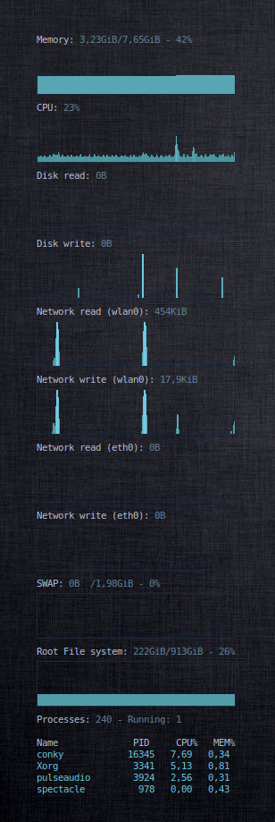

# Conky graphs

## Description
Conky is a free, light-weight system monitor for X.
Graphs is mostly a configuration file for conky that makes conky display the most important computer resource allocations as graphs on your desktop.

## Installation

### Preliminary notes
It is advised to to use a dark backround image to have enough contrast to be able to read the displayed values.

### Manual installation
1. Install [conky](https://github.com/brndnmtthws/conky)
2. Install graphs in a shell:
   ```sh
   GRAPHS_VERSION=1.0.1
   GRAPHS_ARCHIVE="graphs-${GRAPHS_VERSION}.tgz"
   GRAPHS_BASE="${HOME}/.graphs"
   mkdir "${GRAPHS_BASE}"
   curl "https://raw.githubusercontent.com/gernotfeichter/graphs/master/build/distributions/${GRAPHS_ARCHIVE}" -o "${GRAPHS_BASE}/${GRAPHS_ARCHIVE}"
   tar xvzf "${GRAPHS_BASE}/${GRAPHS_ARCHIVE}" -C "${GRAPHS_BASE}"
   rm "${GRAPHS_BASE}/${GRAPHS_ARCHIVE}"
   ```
3. Run graphs in same shell as it was installed:
   ```sh
   cd "${GRAPHS_BASE}"
   conky -c "${GRAPHS_BASE}/graphs.conf"
   ```
   Now you should see graphs on your desktop!
4. To make it permanent, add the last command to your system startup

### Run from git repository
```sh
./gradlew test
```

## Screenshot


## Philosophy

What makes graphs different from similar configration files is the consistency of using graphs for displaying values. Other configurations frequently mix up gauges with graphs etc.

I prefer graphs for one main reason, that is to have the opportunity to see both past and present values at a glance.

The top processes and their individual resource allocations are an exception and are not displayed as graphs. This would require drawing more graphs (clutter) than what is practical to display.

## Dependencies
1. python 2.7
2. bash

## License
GNU GENERAL PUBLIC LICENSE Version 3

Copyright (C) 2021 Gernot Feichter
